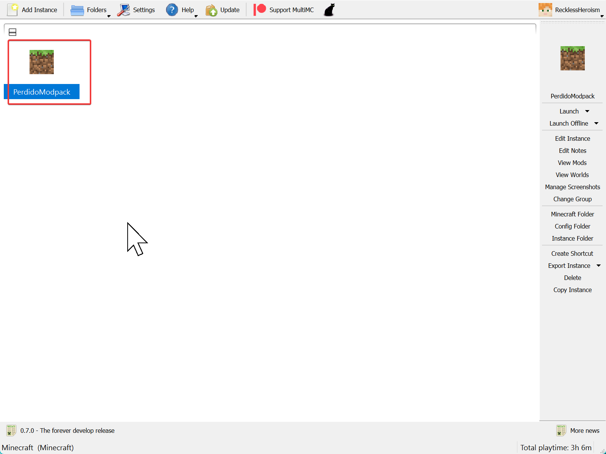

# Perdido Modpack

# Prerequisites

* Minecraft
* [MultiMC Launcher](https://multimc.org/)
* Java 17. Use [THIS LINK](https://github.com/adoptium/temurin17-binaries/releases/download/jdk-17.0.7%2B7/OpenJDK17U-jdk_x64_windows_hotspot_17.0.7_7.msi) to install a version for Windows x64, or just go to https://adoptium.net/.

# Installing

Download the MultiMC Instance for the modpack. You can find it under [Releases](https://github.com/GregRos/minecraft-perdido-modpack/releases/).

## Import to MultiMC

Open MutliMC and drag and drop the instance onto the blindingly white workspace:


It will open an import window. Click OK to create the instance.


It has now appeared:



## Check Java Version

Right click the modpack and choose `Edit Instance`:


Go to `Settings`:


Take a look at the `Java installation`:


This path should point to Java17 (which you either had or downloaded earlier). If it points to Java8 or something else, you’ll need to tick the box and override it manually.

## Launching

Now click Launch:


You will get a log like this. The launcher will download all the mods using the linked modpack metadata and then launch the game.


You may get some errors or warnings but the game should launch at this point.

# Modifying

## Install Packwiz

Install packwiz, the tool Perdido uses to manage its mods. The best way I’ve found to install it is to download the compiled binary from the project’s repository.

First, **log into GitHub (otherwise the link won’t work)**, and then go here:

* https://github.com/packwiz/packwiz/actions/runs/5134548748

Or one of the other builds and download the artifact for the right OS. This is a standalone executable.

Put this executable somewhere in your PATH and after restarting things, you can do:

```
packwiz
```

And it should spit out:

```
A command line tool for creating Minecraft modpacks
...
```

## Clone repository

Go somewhere in the terminal and do:

```
git clone https://github.com/GregRos/minecraft-perdido-modpack.git
```

Or something. 

Now you can use packwiz to modify the mods. Have fun.
